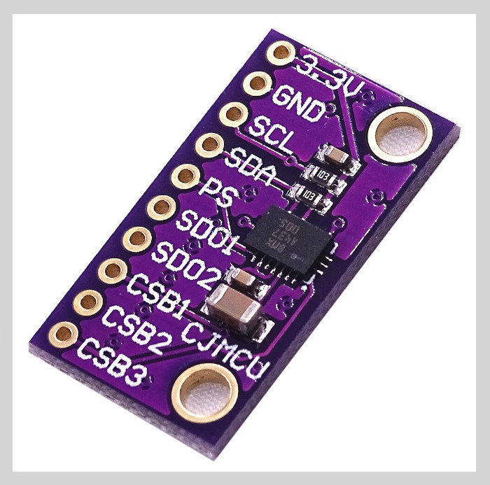

BMX-055
=======

Forked form [Kris Winer's BMX-055](https://github.com/kriswiner/BMX-055), but my version adopted for for ESP32-WROOM and does not have extra components such as display and pressure meters.

 Demonstrate basic BMX-055 functionality including parameterizing the register addresses, initializing the sensor, 
 getting properly scaled accelerometer, gyroscope, and magnetometer data out. Added display functions to 
 allow display to on breadboard monitor. Addition of 9 DoF sensor fusion using open source Madgwick and 
 Mahony filter algorithms.
 
 This sketch is a work in progress...
